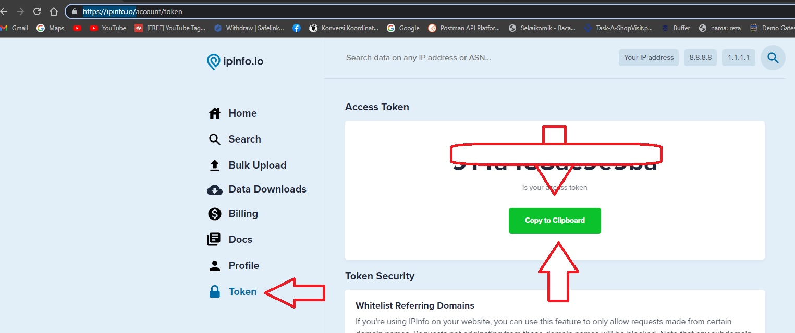
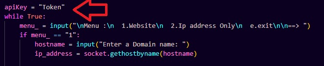

#  **PROGRAM CHECK LOKASI IP & WEB IP PYTHON**

[](https://www.tiktok.com/@ezzuutt)


## **Cara Install**


- cmd atau terminal apapun
- pastikan di  komputer sudah terinstall git dan python 

cara install git : https://github.com/Rezastein/Eza-Git

cara install python : https://www.petanikode.com/python-windows/


- comand

```sh
git clone https://github.com/Rezastein/iplocationcheck.git
cd iplocationcheck
python3 -m pip install -r requirements.txt
```
daftar acount **ipinfo.io** : https://ipinfo.io/

masuk ke dasboard **ipinfo.io**(cari Token & Copy Token)

- buka file checkip.py & paste Token yang tadi di copy ke...


- comand run file

```sh
python3 checkip.py
```